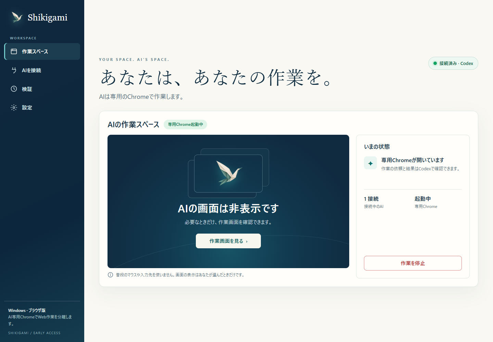

# Shikigami

**あなたは、あなたの作業を。AIには、専用の作業スペースを。**

Windowsで普段のPC作業を続けながら、AIエージェントに裏でブラウザ作業を任せるためのオープンソースプロジェクトです。専用のGoogle Chromeを非表示で起動し、MCP経由で操作します。普段のChromeにタブを増やさず、ホストのマウス移動やキーボード入力を使いません。

> **Windows向けアルファ版です。** 作業スペースUI、共有Chrome、Codex接続設定、停止・再開を実装しています。インストール用ZIPも用意しました。インストーラーの実行・アンインストールは未検証です。ブラウザ作業専用で、Windowsアプリ全般の分離は含めません。



[最初の生成デザイン案](docs/design/shikigami-workspace-concept.png)をもとに実装しています。

[製品化計画・UX仕様](docs/PRODUCT_PLAN.md) · [技術調査・実測結果](REPORT.md) · [MITライセンス](LICENSE)

## 現在できること

- 独立した一時プロファイルの非表示Chromeで、移動・タブ・フォーム・クリック・スクロールを操作。
- Codex等のMCPクライアントから、専用ブラウザの27個の基本ツールを呼び出し。
- 必要なときだけ、ローカル確認ページで直近のAIスクリーンショットを閲覧。
- 人間の同時操作と、前面化・可視ウィンドウ・メモリ消費を計測。

Shikigamiはブラウザの操作経路とプロファイルを分けます。ファイル・ネットワーク・OS権限を隔離するセキュリティサンドボックスではありません。既存エージェントのcomputer-useを自動で移し替える機能もありません。

## Windowsで使う

[Windows版ダウンロード](https://github.com/ukitako1030/Shikigami/releases/tag/v0.1.0-alpha.1)から`Shikigami-windows-x64.zip`を取得します。

1. ZIPを**すべて展開**し、`Shikigami.exe`を開きます。
2. 「インストールする」を押し、以後はスタートメニューの**Shikigami**から起動します。
3. アプリの「AIを接続」で説明を確認し、Codexの接続設定を追加します。
4. Codexの新しいチャットで「**Shikigamiの専用Chromeで○○して**」と依頼します。

Google Chromeが必要です。Nodeランタイムは同梱しています。アプリ画面は個人用Chromeとは別のアプリウィンドウ、AIの作業は非表示の専用Chromeで動きます。画面を閉じても裏の作業は続きます。

この配布物は未署名のアルファ版です。ビルド・同梱ランタイム・ソース上の主要導線は確認していますが、インストーラーの実行は検証環境の承認ポリシーで拒否されたため、実機の導入・削除は未確認です。一般向け安定版ではありません。

アプリは`%LOCALAPPDATA%\Shikigami\app`、作業データは`%LOCALAPPDATA%\Shikigami\data`に置く設計です。アンインストール後も作業データとCodex接続設定は残るため、不要な接続はCodexの設定から削除してください。更新・削除時はShikigamiと、そのMCP接続を終了してください。

## ソースから起動する

必要なもの：Windows 11、Node.js 22以上、npm、インストール済みGoogle Chrome。以下は開発者向けです。

```powershell
git clone https://github.com/ukitako1030/Shikigami.git
cd Shikigami
npm ci
npm start
```

`npm start`でアプリ画面が開きます。AI画面は初期状態で非表示です。「検証」から「60秒の同時操作テスト」を押し、入力欄で文字入力・クリック・スクロールを続け、終了後に干渉の有無を選びます。AI側は非表示の3タブで作業します。巡回を完了するため、60秒を少し超える場合があります。

確認画面を閉じても処理は継続します。プレビューは表示中に更新される静止画像です。AIブラウザは無操作2分で閉じます。共有サービスはMCP接続も画面アクセスもない状態が30分続くと終了します。`npm run start:service`は画面を自動で開かずURLだけを表示します。

## Codexに接続する

1. [codex-config.example.toml](codex-config.example.toml)のパスをクローン先の絶対パスに置き換えます。CodexからNodeが見つからない場合は`command`にも絶対パスを指定します。
2. CodexのMCP設定へそのセクションを追加します。既存設定全体を置き換えないでください。
3. MCP接続を読み込み、このプロジェクトで「**Shikigamiの専用Chromeで○○を調べて**」と依頼します。

`codex mcp get shikigami --json`で登録を確認できます。MCPがサーバーを起動するため、通常利用時は`npm start`を別途実行する必要はありません。既存チャットでツールが見つからない場合は、MCP接続を再読込して新しいチャットを使います。[公式OpenAIドキュメント](https://learn.chatgpt.com/docs/extend/mcp?surface=cli)

設定例は書き込み扱いの操作に承認を求めます。非対話クライアントが`approval_policy = "never"`の場合、操作が拒否されることがあります。必要な自動承認は利用者が自身の設定で選びます。個人用の承認設定はリポジトリに含めていません。

`shikigami_workspace`は確認ページのURLを返します。`browser_take_screenshot`を**filenameなし**で呼ぶと画像がMCP応答と確認ページへ届きます。作業が終わったら`browser_close`を使います。普段のChromeのCookieやパスワードは共有しません。

同じデータ保存先に接続するアプリとMCPは、1つの専用Chromeを共有します。命令は順番に処理されます。複数AIの仕事を意味的に分離する機能はまだないため、初期版では1つの作業を1つのAIから依頼してください。別セッションが通常のWindows computer-useを使っている場合、その操作はShikigamiへ自動転送されません。

## 実測した範囲

2026年10月6日、Windows 11 Home、Ryzen 7 5700X、RAM 16GB、RTX 4070 SUPERで検証しました。

| 項目 | 結果 |
|---|---|
| 非表示Chromeで3タブ・入力・スクロール・ページ移動 | 自動試験9チェック成功 |
| Codexモデルから専用Chromeを操作 | 移動・入力・クリック・結果確認・終了に成功 |
| 人間の操作との並行 | 初回Edge版で確認。本人は干渉なしと回答。Chromeでの人間による再試行は未実施 |
| Chromeの前面化／可視ウィンドウ | 自動試験の標本内では0件 |
| MCP＋ChromeのWorking Set合計 | 軽いローカル3タブでピーク746.3MiB。ラッパー等は別集計 |
| Windowsアプリ全般 | 未対応・未検証 |

全サイト、長時間利用、瞬間的な干渉まで保証する結果ではありません。測定条件と限界は[REPORT.md](REPORT.md)に記載しています。

## 再検証

```powershell
npm test
```

SDKによるMCP接続、日本語フォーム入力・クリック、画像応答、非公開ツールの拒否、確認APIのアクセス制御を確認します。LLM呼び出しはありません。

- `npm run test:shared`：2つのMCP接続が同じChromeを参照すること、操作中の停止、待機命令の破棄、再開、設定保存を独立したテスト領域で確認。
- `npm run test:ui`：接続・プレビュー・停止・再開・診断・切断・PC／モバイル表示を確認。実際の人間の同時操作を代行した結果ではありません。
- `npm run test:codex`：保存済み設定とインストール済みCodex CLIを使う実モデル試験。**Codex利用枠を消費します。** クライアント既定のモデルを使い、`SHIKIGAMI_TEST_MODEL`で変更できます。
- CLIが見つからない場合、`SHIKIGAMI_CODEX_CLI`に`codex.exe`または`bin/codex.js`の絶対パスを指定してください。`node scripts/verify-codex.mjs --check-cli`はモデルを呼ばずにCLI検出だけを確認します。

## データと制限

- `.runtime/`には接続トークン、`artifacts/`には画面画像・操作ログ・実測データ等を保存します。いずれもGit対象外です。共有前に中身を確認してください。
- 人間の入力文章は取得せず、イベント種別・時刻を記録します。OS監視はマウス座標・前面ウィンドウ識別子・AI側プロセスのメモリを読み取ります。他アプリ本文、キー入力フック、クリップボードは取得しません。
- 確認APIは127.0.0.1へのバインド、ランダムトークン、Host／Origin確認を使います。同じWindowsユーザー内のプロセスを分離する仕組みではありません。
- サーバーの任意コード実行、ページ内JavaScript実行、ファイルアップロード／ドロップ、ダイアログ応答はMCPの公開対象外です。
- CAPTCHA、passkey、Windows Hello、拡張、DRM、音声・カメラ、ネイティブダイアログ、長時間動作、スリープ復帰は未検証です。
- タブ数の強制上限、クラッシュ後のMCP自動再接続、永続ログインは未実装です。当面は3タブ程度で運用してください。

## ライセンスと費用

[MIT](LICENSE)。主な依存先は[Playwright MCP](https://github.com/microsoft/playwright-mcp)と[MCP TypeScript SDK](https://github.com/modelcontextprotocol/typescript-sdk)で、それぞれのライセンスに従います。ChromeやCodexには各製品の利用条件が適用されます。

専用サービスの月額契約や別のLLM APIキーは不要です。Codex利用料は別扱いです。`package.json`の`private: true`はnpmへの誤公開を防ぐもので、GitHubリポジトリは公開です。

## Windows配布物のビルド

```powershell
powershell -NoProfile -File scripts/build-windows.ps1
```

Node 22以上（同じフォルダーのLICENSEを含む）、npm、Windowsの.NET Framework C#コンパイラーが必要です。`dist/Shikigami-windows-x64.zip`を生成します。ソースとランタイムを明示的に収録し、個人設定・トークン・実測ログは含めません。
