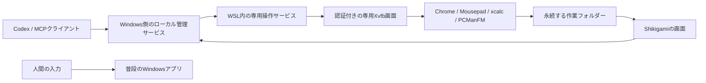

# 専用Linuxデスクトップ試作

**専用スペースを起動 → Codexに仕事を依頼 → 保存された成果物を受け取る。** Windowsで自分の作業を続けながら、AIにWSL内の非表示Linuxデスクトップを使わせるソース版の試作です。Google Chrome、エディター、電卓、ファイル管理を操作できます。**Windowsアプリには対応していません。** 現在の[Windows配布ZIP](../README.md#windowsで使う)はブラウザ専用で、この試作を含みません。


## 使い方

既存のWSL 2 / Ubuntu 22.04、Windows側のNode.js 22以上とnpmが必要です。セットアップはそのUbuntuに専用の非管理者ユーザーと依存パッケージを追加します。WSL未導入PC向けの自動インストーラーはまだありません。

```powershell
npm ci
wsl -d Ubuntu-22.04 -u root --exec sh scripts/setup-desktop-lab.sh
npm run start:desktop
```

最後のコマンドが返すローカルの`panel` URLを開きます。URLには接続用トークンが含まれるため、共有しないでください。

1. 画面の「専用スペースを起動」を押します。起動するまでLinuxアプリは動きません。
2. 「AIとの接続」で専用Linuxへの操作許可を確認し、Codexの設定を追加します。設定追加だけでは接続済みになりません。Codexの新しいチャットを開くかMCPを再読み込みし、画面の「MCP接続」で実際の接続を確かめます。利用者ごとに初回の登録が必要です。
3. Codexで「Shikigamiの専用デスクトップでエディターを開き、日本語で作業メモを作成し、結果を作業フォルダーに保存して」と依頼します。既存のcomputer-use操作は自動では切り替わらないため、専用の`desktop_*`ツールを使うよう指定してください。
4. 「成果物」で保存ファイルの一覧を更新し、必要なファイルの「PCに保存」を押します。Windowsの`Documents/Shikigami/成果物`へ書き出し、同名ファイルは上書きしません。保存先のパスは画面に表示され、コピーできます。停止後や再起動後も保存済みファイルを一覧・取得できます。1ファイルの保存上限は20MiBです。

「作業画面を見る」を押すと専用画面の静止画像を表示し、表示中だけ約3秒ごとに更新します。画面を隠した後、別タブ、非アクティブ時には取得しません。手動介入を明示的に有効にすると、その画像上のクリック・スクロールや別の入力欄からの文字送信、ChromeのURL移動ができます。普段のWindowsのマウス・キーボード入力は使いません。

「同時操作テスト」に10秒の固定手順デモと60秒の人間との並行試験があります。固定デモはAIの推論結果ではありません。デモ用`Shikigami-note`は通常の作業メモと別に保存し、通常の成果物を上書きしません。停止すると未保存の編集は失われます。

## 仕組みと境界



専用サービスはUbuntu 22.04の非管理者ユーザー`shikigami-lab`で動きます。Xvfbは通常のWSLgと別のディスプレイ、非公開の認証Cookieを使い、TCP待受を無効にします。`xdotool`と`xclip`はその専用画面だけに接続します。HTTP画面は127.0.0.1、ランダムトークン、Host/Origin検査で保護し、操作を直列化します。停止時は待機操作を取り消し、専用セッションに属するLinuxプロセスを限定して終了確認します。終了を確認できなければ画面に表示し、停止を再試行できます。

**これは表示・入力先の分離であり、ファイルやネットワークを隔離するセキュリティサンドボックスではありません。** 既存WSL環境を共有し、ホストドライブの自動マウントも制限していません。Windowsアプリ、認証画面、Windowsのメモ帳やExcelはこの試作から操作できません。

## 実機で確認したこと

2026年10月7日、Windows 11 Home、Ryzen 7 5700X、RAM 16GB、WSL 2 / Ubuntu 22.04.5 LTSで試験しました。ローカルの`artifacts/desktop-test.json`と`artifacts/desktop-codex.json`は個人パスや操作記録を含み得るためGitには含めていません。

| 項目 | 結果 |
|---|---|
| 専用LinuxのChrome、Mousepad、xcalc、ファイル管理 | 起動と画面確認に成功。Chromeで`example.com`を表示 |
| 日本語のメモ保存 | Codexがエディターで作成し、保存ファイルの本文と入力文を照合 |
| Codex実モデルからの操作 | 新しいMCPの13ツールを公開。実モデルが画面取得・Chrome操作・保存・ファイル読取・停止など14回のツール呼び出しをすべて成功 |
| 成果物の受け渡し | 一覧・ファイル取得、MCPの`desktop_files`/`desktop_read_file`を確認。停止後の読取と、停止・再起動をまたぐ保存を確認。「PCに保存」はChromeの自動試験とCodex内ブラウザの実操作で、Windowsへ保存した本文を照合。同名ファイルを上書きしない試験も成功 |
| 10秒の固定デモ | 最新回帰で10.1秒、3巡回・36操作。日本語入力と保存内容の一致を確認 |
| 操作停止と後片付け | 操作中の停止・待機操作の取消、停止後の入力拒否、セッションを限定した残存プロセス回収を試験 |
| 人間との並行 | **以前の**62.2秒試験で試験ページの入力51回・マウス移動103回等と、利用者の「干渉なし」を記録。今回のChrome/Codex経路では人間との追加試験をしていない |

Codex試験では、Chromeの`example.com`をスクリーンショットで確認し、日本語メモを保存した後に`desktop_files`と`desktop_read_file`で本文を確認しました。停止後の`desktop_read_file`も成功しました。これによりAIが専用画面で作業し、成果物を取り出す一連の経路を確認しています。Codexの接続設定を利用者の通常環境へ追加した試験ではなく、独立した試験設定で行いました。

### メモリの読み方

9:10 JSTの回帰でChromeを含む専用Linuxプロセス群の一標本は**PSS 619.9MiB / RSS合計1765.9MiB**、10秒デモ中のピークは**PSS 692.7MiB / RSS合計2022.5MiB**でした。PSSは共有ページを按分し、RSS合計は共有ページの重複を含みます。別の確認用デスクトップも同時稼働していた測定であり、WSL本体、Windows側Node、確認用Chrome、Codexは含みません。WSL全体のメモリ値と重複するため足し合わせません。短い試験の値で、単独稼働の増分や長時間ピークを表しません。

以前のエディター＋電卓だけの測定はPSS約200MiBでした。Chromeを加えた現在の作業をその値で見積もらないでください。測定値は起動状態や共有ページの按分相手でも変わります。

### 人間との操作試験の限界

以前の60秒試験では、専用Linux側が22巡回・264操作を実行し、保存内容が一致しました。試験ページの入力51回、マウス移動103回、クリック7回、ホイール24回を記録し、利用者は「干渉なし」と回答しました。Windows側の観測617標本で管理サービス／WSL起動プロセスが前面になった標本は0でした。ただし別のWindowsアプリでの入力内容は記録しておらず、IME変換の正確さ、長時間利用、瞬間的な干渉まで保証する結果ではありません。**今回のChrome・Codex・成果物経路について、人間の追加並行試験は行っていません。**

## 準備・配布・ライセンス

セットアップ時、ChromeはGoogle公式のHTTPS配布元の`.deb`から導入します。今回の実機ではGoogle Chrome 155.0.8059.39を使用しました。Chromeの追加依存は8パッケージ、約146MBのダウンロードと約471MBのディスク使用、PCManFMは13パッケージ、約3.2MBのダウンロードと約11.8MBのディスク使用でした。既存パッケージのアップグレードはありませんでした。導入量やバージョンは今後のリポジトリ状態で変わります。

`npm run test:desktop`は独立した試験サービスでSDK・UIなどを確認します。ローカルのスクリーンショットやログはGit対象外の`.runtime/`と`artifacts/`に保存します。現在のWindows向けZIPはブラウザ版だけを含み、専用デスクトップはソースからの利用に限定します。

Shikigamiの自作コードは[MIT](../LICENSE)です。Google ChromeはMITの対象外で、Googleの利用条件が適用されます。Chromeをリポジトリや配布ZIPに同梱せず、セットアップ時に公式配布元から導入します。Ubuntuの各パッケージにもそれぞれのライセンスが適用されます。

## 残る課題

専用Linux上のChrome操作、成果物の保存・取出し、停止後の再読取は実装と実測を完了しました。残るのはWSL未導入PC向けの一般的な導入、長時間利用とスリープ復帰、IMEの直接入力や複雑なサイト、専用ディストリビューションへの分離です。Windowsアプリを扱う経路は別の技術検証が必要です。
