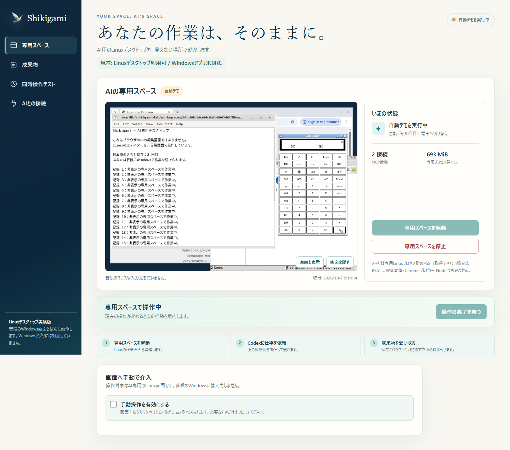
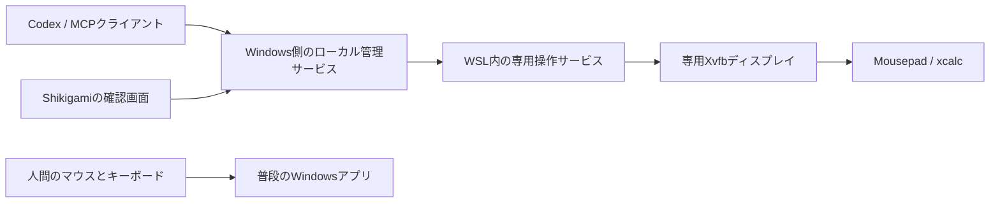

# 専用デスクトップ試作

2026年10月7日。ブラウザ以外のアプリを、普段のWindowsの入力から分けて操作するための実証版です。Cua Spacesのような専用デスクトップ体験をWindows向けに作る最初の段階です。

**現在の対象はLinuxのエディターと電卓です。Windowsのメモ帳やExcelを動かせる版ではありません。** また、既存のブラウザ版とは別の実験用サービスです。配布ZIPへの統合や一般向けインストールは未実装です。



## 試せること

1. 「専用スペースを起動」で非表示のLinuxデスクトップを用意します。
2. 「10秒デモを試す」で、エディターへの日本語入力・保存、電卓への切り替えとクリックを実行します。これは固定手順の自動試験で、AIの推論結果ではありません。
3. 「作業画面を見る」で実際のデスクトップの静止画像を表示します。表示中は3秒間隔で更新し、非表示・別画面・非アクティブ時は取得しません。
4. 必要なら「手動操作を有効にする」で、画面のクリック・スクロール、文字送信、保存キーを専用環境へ送れます。
5. 「専用スペースを停止」で専用プロセスを終了します。未保存の編集は失われます。保存済みの試験メモはLinux側のセッションごとのフォルダーに残ります。現段階では再起動後の履歴一覧・ファイル取り出しUIはありません。

「同時操作テスト」は60秒ほど実行します。その間、普段のWindowsのメモ帳やブラウザを操作して、終わったら干渉の有無を選びます。ページ上の試験入力欄は文章を保存せず、入力・マウス操作の種類と時刻だけをローカルに記録します。別アプリでの入力内容は取得しません。

## 実装



- 既存のUbuntu 22.04上に専用の非管理者Linuxユーザー `shikigami-lab` を作成。Windowsの管理者権限は今回使用していません。
- Xvfbは通常のWSLgとは別のディスプレイ番号と認証Cookieを持ち、TCPリスナーを無効化しています。
- 操作プロセスから既存DISPLAY、Wayland、DBus、WSL実行連携等の設定を外し、専用DISPLAYとLinuxだけのPATHを指定します。
- クリック・スクロール・キーはxdotoolで専用Xへ送信。日本語文字列はそのXディスプレイ内のクリップボードで渡し、Windowsのクリップボードは使用しません。
- UIは認証トークン付きの127.0.0.1上だけで提供します。Host/Origin検査、入力上限、操作の直列化、停止時の待機命令取消を実装。
- 停止時は通常終了に加え、Linuxユーザー・セッション識別子・pidfdで対象を限定して残存プロセスを確認します。親終了時のシグナルも設定しています。
- Codex既存のcomputer-useを自動で置き換えるものではありません。専用の `desktop_*` MCPツールを使う必要があります。

**これは入力と表示を分ける試作であり、ファイルやネットワークを隔離するセキュリティサンドボックスではありません。** 既存WSLのカーネル・環境を共有し、ホストドライブの自動マウントを制限する実装もまだありません。製品版では専用ディストリビューション、ファイル受け渡しの範囲、復旧を別途設計します。

## 実機で確認した結果

Windows 11 Home、Ryzen 7 5700X、物理メモリ15.93GiB、WSL 2 / Ubuntu 22.04.5 LTSで実施しました。

| 項目 | 結果 |
|---|---|
| 非表示の専用デスクトップ起動 | 確認済み |
| Mousepadへの日本語入力とCtrl+S保存 | 確認済み。実際に保存されたファイル内容と入力文を照合 |
| xcalc起動、アプリ切り替え、座標クリック | 確認済み。画面で計算結果6も目視確認 |
| 専用画面の撮影 | 確認済み。エディターと電卓を実画像で確認 |
| MCP | 10ツールをSDKクライアント2つから呼び出し、同じ専用環境を操作 |
| Codexモデルによるこのデスクトップの操作 | 未検証。既存ブラウザ版のCodex実測とは別 |
| 画面非表示時の継続動作と撮影停止 | 自動試験で確認済み |
| 操作中の停止、停止後の入力拒否、再起動 | 自動試験で確認済み |
| 通常停止後のLinuxプロセス | 専用ユーザーのアプリ・Xサーバー残存なしを確認 |
| WSL起動プロセスの異常終了後 | セッションを限定した残存プロセス回収を試験で確認 |
| PC・狭幅UI、手動操作、切断表示 | Chromeの自動試験と実画像で確認済み |
| 人間の入力・マウス操作との並行 | 62.2秒の協力試験で基本操作を確認。試験ページ内の入力51回、マウス移動103回等と、利用者の「干渉なし」の回答を記録 |
| 人間がメモ帳等の別Windowsアプリを使い続ける操作 | 使用アプリの申告がないため未確認。上記の基本操作と区別 |
| Windows用アプリ、Linux Chrome、IMEの直接入力、長時間動作、スリープ復帰 | 未検証 |

11.5秒の自動デモでは4巡回・48操作が完了し、各巡回で保存内容が一致しました。Windows側の観測99標本で、管理サービス／WSL起動プロセスが前面になった標本と可視ウィンドウを検出した標本はともに0でした。カーソルの移動12回は人間等の操作を区別できず、AIの干渉とも非干渉とも断定しません。最大観測間隔798msの空白があり、瞬間的な干渉を完全否定する測定ではありません。

### 人間との同時操作試験（8:49〜8:50 JST）

利用者がキーボード入力とマウス操作を行い、画面で「干渉なし」を選択しました。チャットでも問題を感じなかったと回答しています。対応するローカルの生記録と集計結果を照合しました。

| 計測項目 | 結果 |
|---|---|
| 自動デモの実行時間 | 62.2秒 |
| 専用デスクトップ側 | 22巡回・264操作、エラー／中断なし |
| エディターの保存 | 各巡回で保存内容と入力文の一致を確認 |
| 試験ページでの人間操作 | 入力51回、マウス移動103回、クリック7回、ホイール24回 |
| Windows側の観測 | 617標本、前面ウィンドウ識別子の変化0回 |
| 管理サービス／WSL起動プロセスの割り込み | AI側が前面になった標本0、可視ウィンドウ検出0／39回の調査 |
| 専用Linuxプロセス群のピーク | PSS 198.7MiB、RSS合計347.3MiB |
| 利用者の回答 | 干渉なし |

**この試行では、専用Linuxデスクトップと人間の基本的な入力・マウス操作の並行動作を確認できました。** 自動デモは固定手順であり、Codexモデルによる作業完了の実証ではありません。試験ページの入力文を保存していないため、文字欠落やIME変換の正確さは照合していません。別Windowsアプリでの入力、長時間利用、あらゆる操作の無干渉を保証する結果ではありません。

観測間隔は平均99.5ms、最大892msでした。OS上のカーソル位置の変化153回には人間自身の操作を含み、その回数からAIの干渉を推定しません。プロセス観測はWindows側の管理サービスとWSL起動プロセスの範囲です。試作コードの `humanConcurrencyVerified` は初期値falseのままで回答に連動しないため、この項目単独を合否判定に使わず、実行記録・人間の操作イベント・利用者の回答を根拠に評価しています。

### メモリ

上記のエディター＋電卓の小さな自動試験で、専用Linuxプロセス群のピークは次のとおりでした。

- **PSS：約200.3MiB**。共有ページを按分した値。
- **RSS合計：約346.8MiB**。共有ページの重複を含む値。
- 別途、試験停止後の `vmmemWSL` のWorking Setは約1000.8MiBでした。既存Ubuntu、WSL本体、キャッシュ等を含む全体値で、このアプリだけの消費量や増分ではありません。

PSS/RSSの数値にはWindows側Node管理サービス、確認用Chrome、Codex、WSL本体は含みません。また、上記のWSL全体値とLinux側値は重複があるため足して総量にしません。アプリ全体の厳密な増分、Chromeを含めた作業、長時間のピークは未測定です。**「全体で200MB」や「16GBなら常に快適」とは結論づけていません。**

その後の稼働中の一標本では、Windows側NodeのWorking Setは57.5MiB、WSL全体は1267.3MiBでした。また、確認用と自動試験用の2つのデスクトップを同時に動かす再試験では片方のPSSが約149MiBになりました。共有ページの按分相手が増えるためで、同じアプリがさらに軽量化されたという意味ではありません。

## 開発者向けの準備

既にWSL 2のUbuntu 22.04が入っている環境向けです。セットアップはそのディストリビューションにパッケージと専用ユーザーを追加します。今回の追加は46パッケージ、ダウンロード約67.4MB、追加ディスク約117MBでした。大半のダウンロードは日本語フォントです。既存パッケージのアップグレードはしていません。Windows側の有料契約・OSアップグレードは行っていません。

リポジトリのルートから:

```powershell
npm ci
wsl -d Ubuntu-22.04 -u root --exec sh scripts/setup-desktop-lab.sh
npm run start:desktop
```

最後に出力されたJSONの `panel` URLを開きます。Linuxデスクトップは「起動」を押すまで動きません。ソース版の試作であり、WSL未導入PC向けの簡単インストーラーではありません。

```powershell
npm run test:desktop
```

試験は別の管理サービスを用意し、終了時に専用環境を閉じます。生ログ・計測結果・スクリーンショットはGit管理外の `.runtime/` と `artifacts/` に保存します。

## Codexとの接続

「AIとの接続」で専用Linuxの操作範囲を確認してから設定を追加します。変更するのは `mcp_servers.shikigami_desktop` の項目だけで、既存設定をバックアップします。画面の許可チェックは初期オフです。設定追加と実際のエージェント接続は別であり、新しいチャットまたはMCP再読み込み後に確認します。

手動設定も同じ画面に表示します。公開設定の既定は書き込み操作の承認を求めます。管理サービスを再起動した場合、既存MCP接続も再接続が必要です。通信失敗したクリックや入力を自動で再送して二重実行する復旧は実装していません。

## 次の段階

1. 試験ページでの基本的な同時操作は確認済み。別のWindowsアプリ・IME・長時間へ検証範囲を広げる。
2. この環境内でGoogle Chromeも動かし、エディター・ファイル管理との一連の作業を検証する。
3. 保存ファイルの取り出し、専用環境の再利用、復旧と後片付けを整える。
4. WSL未導入PCの案内・導入と、専用ディストリビューションへの分離を製品化する。
5. Windows専用アプリを扱う経路は別途実証する。Linux試作の成功でWindowsアプリ対応を済ませたとは扱わない。

ShikigamiのコードはMITです。Cua SpacesのFSLコードは取り込んでいません。Ubuntuのパッケージは公式リポジトリから導入する形で、現在のWindows ZIPへ再配布していません。将来のイメージ配布時には各依存パッケージのライセンスとソース提供条件を確認します。
