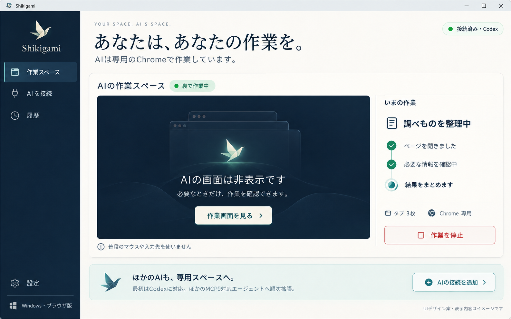
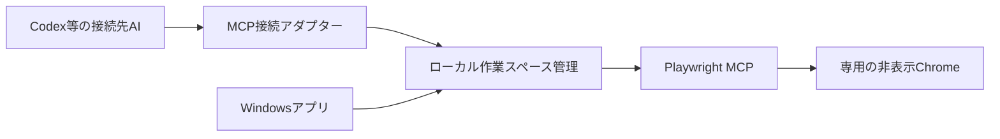

# Shikigami 製品化計画

2026年10月6日。設計案と初期実装の状況です。未実装の機能を含みます。

更新：この案に沿う作業スペースUI、共有サービス、Codex接続設定、停止・再開、Windows配布ZIPを実装しました。UIと共有サービスの試験は成功。インストーラー実行は検証環境の承認ポリシーで拒否されたため、導入・アンインストールは未確認です。

## 目指す体験

**WindowsにShikigamiを入れ、使いたいAIを接続する。AIは専用スペースで作業し、人間は普段のPC作業を続ける。**

非エンジニアがターミナル、MCP、プロファイル、ヘッドレスという用語を理解しなくても使える製品にします。最初はWindows 11とCodex、ブラウザ作業に集中します。AIが作業を判断する役割は接続先エージェントが持ち、Shikigamiは作業場所、観察、停止、接続管理を提供します。

「インストールだけで既存AIの全操作を横取りする」とは約束しません。初回にエージェントの接続先と使う道具を設定する必要があります。その設定作業をアプリの案内と接続テストにまとめるのが製品化の中心です。

## 現時点の到達点

| 範囲 | 状態 |
|---|---|
| 非表示の専用Chrome、独立した一時プロファイル | 実装・実機確認済み |
| MCP経由の移動、フォーム、タブ、画像 | 実装・確認済み |
| 実際のCodexモデルからの操作 | CLI経由で確認済み |
| 人間との同時操作 | 初回Edge版で基本操作を確認。Chromeでの人間による再試行は未実施 |
| 開発者向けの試験パネル | 実装済み |
| トップUI、接続設定、共有ブラウザ、停止・再開 | 実装・自動試験済み |
| Windows用インストーラー | コンパイル・パッケージ化済み。実行・導入は未確認 |
| 常駐管理、復旧、永続ログイン、複数エージェント | 未実装 |
| Windowsアプリ全般を分離した操作 | 未検証。初回製品の範囲外 |

現在のコードをそのまま「誰でもインストールして使える完成アプリ」として配布しません。GitHubでは試作と製品化計画を公開し、一般利用者向けの配布条件を満たしてからインストーラーを提供します。

## 利用者の流れ

1. **インストール**：Windows用セットアップを開く。Nodeや開発ツールの手動導入は不要にする。保存場所・自動起動の選択肢を明示。
2. **準備確認**：Google Chromeの有無を確認。なければ公式インストール先を案内し、終わったら再確認できる。既存の個人用プロファイルは使わない。
3. **AIを接続**：「Codexを接続」を選ぶ。追加する設定と対象を平易に示し、同意後に既存設定をバックアップしてShikigamiの項目だけを追加。失敗しても元に戻せる。
4. **動作確認**：専用のローカルページを開いて文字を記録するテスト。実際に接続先AIから操作できた場合だけ「接続できました」と表示する。設定ファイルを書いただけでは成功にしない。
5. **いつも通り依頼**：Codex側で仕事を依頼。対応するブラウザ作業はShikigamiの接続を使う。未接続や非対応操作を検出したら理由を表示し、通常のcomputer-useへ黙って切り替えない。
6. **必要時だけ確認**：アプリを閉じても裏の作業は続く。「作業画面を見る」で初めてプレビュー取得を開始する。完了や人間の対応が必要な場合に絞って通知。
7. **終了**：「作業を停止」で新しい操作を受け付けず、専用ブラウザを終了。外部サイトに済んだ投稿や送信を取り消す意味ではないことを明示する。

## トップ画面

画像は生成したデザイン案です。Codex接続、進捗、タブ数などの表示は構成例で、実データの画面ではありません。実装時は取得できた事実だけを表示します。エージェントが作業名を送っていなければ「調べものを整理中」と推測せず、「ページを操作中」等の観測可能な状態を使います。

基本構成は左の小さなナビゲーションと、大きな作業スペースです。情報の優先順位は、接続状況、現在の状態、画面を見る操作、停止操作、直近の履歴の順です。メモリやログ、診断値は詳細画面に置きます。

濃紺と温かい白を基調に、青緑を接続状態のアクセントにします。折り紙の式神を控えめに使い、仕事を妨げない静かな印象にします。AI画像はブランド表現に使い、ボタンや状態表示は編集可能な実テキストで実装します。

| 状態 | 見せる内容 | 主な操作 |
|---|---|---|
| 初回・未接続 | 短い説明と接続手順。空のグラフや偽の履歴は出さない | AIを接続 |
| 接続済み・待機 | 「依頼を待っています」。CPUやブラウザを必要以上に起動しない | 接続方法を見る |
| 作業中・非表示 | エージェント名、観測できた作業状態、タブ数 | 作業画面を見る／停止 |
| プレビュー表示 | 取得時刻付きの画面と、画面を隠す操作 | 画面を隠す |
| 人間の対応待ち | ログイン等の理由。未対応ならその事実と戻り方 | 対応手順を見る |
| 切断・エラー | 原因、保存された状態、再試行。ローディングを永久に続けない | 再接続／詳細 |
| 完了 | 終了状態と接続先AIへの案内 | 結果を確認 |
| 停止済み | 作業が停止したことと再開条件 | 接続を再開 |

### UI・UXの品質条件

- 1366×768、1920×1080、Windowsの125%／150%表示倍率を基準にし、狭いウィンドウでも主要操作を隠さない。
- 日本語の可読性、十分な余白、明確なフォーカス、キーボード操作、コントラストを確認。色だけで状態を区別しない。
- 読み込み・空状態・失敗・成功・停止・やり直しを実画面で検証する。
- スクリーンショット更新は表示中だけ。静止画とライブ表示を混同させない。画面取得時刻を表示。
- 作業中のトーストを連発しない。通知と自動起動は利用者が選ぶ。
- 非技術者が説明を受けずに初回接続まで進めるか、実機で確認する。

## 推奨構成

今回の最小配布版は、専用プロファイルのChromeアプリウィンドウと、同梱Node・小さなWindowsセットアップを使用します。AIブラウザとは別のウィンドウです。配布ZIPにはNodeを含め、利用者の手動導入を不要にしています。

将来の常駐メニューやネイティブ機能拡張では、Windowsアプリの外枠にTauriを候補とします。設定画面と常駐メニューを担当し、専用Chromeと操作サービスを別プロセスにします。TauriはWindowsのセットアップ実行ファイルを配布でき、外部バイナリを同梱する仕組みがあります。Node側の操作サービスを同梱し、利用者に開発環境の導入を求めない設計にします。[Windowsインストーラー](https://v2.tauri.app/distribute/windows-installer/)、[外部バイナリ同梱](https://v2.tauri.app/develop/sidecar/)

Tauriを採用する場合の設定画面はWindowsのWebView2を使用しますが、**AIの作業ブラウザはGoogle Chrome**です。Tauri版のメモリ消費や起動速度はまだ測定していません。製品の軽さは、ブラウザを必要時だけ起動すること、タブ上限、非表示時の画像取得停止、不要なワークスペース終了で管理します。

初回の技術試作はMCP接続ごとにブラウザを作っていました。今回、アプリとエージェントが同じ作業スペースを参照する共有サービスを実装しました。ワークスペースID、操作キュー、接続状態、停止状態を管理し、同じブラウザへの競合入力を防ぎます。最初は1エージェント・1スペースに限定します。

「停止」は新しい命令を拒否して専用プロセスを終了する仕様にします。キューに残った命令を再接続時に勝手に再実行しません。普段のChromeや別アプリを閉じないことをテストします。

## 開発の順序と公開条件

| 段階 | 作るもの | 完了条件 |
|---|---|---|
| 0：公開試作（現在） | 実証コード、匿名化した結果、MIT、製品計画、UIイメージ | 個人情報を含めず、手順で試作を再実行できる |
| 1：触れるUI | このデザインの実装、未接続／待機／稼働／停止／エラー画面 | PC実画面と主要導線を操作検証。未実装の状態を成功と表示しない |
| 2：アプリとして接続 | 共有管理層、Codex接続ウィザード、設定バックアップ、確認テスト | アプリに表示する画面がエージェントの操作先と一致 |
| 3：Windows向け配布 | インストーラー、ランタイム同梱、常駐、終了、アンインストール | Node未導入のWindows 11で導入・利用・削除が可能 |
| 4：公開アルファ | 実サイト試験、停止、復旧、メモリ、操作非干渉の再検証 | Chromeで人間がメモ帳・普段のブラウザを使い続ける試験に合格 |
| 後続 | 他のMCP対応AI、永続ログイン、複数スペース | 各機能を個別に実証してから対応範囲を拡張 |

一般公開アルファ前に、連続30分の利用、IME入力、3タブ、プレビュー表示／非表示、切断、停止、Chromeクラッシュ、スリープ復帰を確認します。メモリは待機時と3タブ稼働時を分け、測定条件と実測値を公開します。現在の約0.8GiBという試作の目安を、製品版の保証値として流用しません。

## 範囲・費用

最初の製品はブラウザ作業専用です。Windows標準の仮想デスクトップにウィンドウを移すだけでは入力の独立は保証できません。Windowsアプリ全般は別セッションやVM、アプリ固有APIを検討する別の開発段階とします。

専用サービスの月額契約は不要とする方針です。AI利用料は接続先サービス側で発生します。コード署名を含むWindows配布の運用費用、更新配信、Chromeの再配布条件はインストーラー作成前に確認します。現段階で有料契約やOSアップグレードは行っていません。

## デザイン画像の生成記録

組み込みImagegenでUIイメージと透過の式神マークを生成し、日本語、主要ボタン、非表示状態の表現を目視確認しました。式神マークは実装にも使用しています。画像生成ツールではモデル名を選択・確認できないため、依頼されたGPT Image 2.5での生成とは断定しません。完全なプロンプトは[image-prompt.txt](design/image-prompt.txt)に保存しています。
